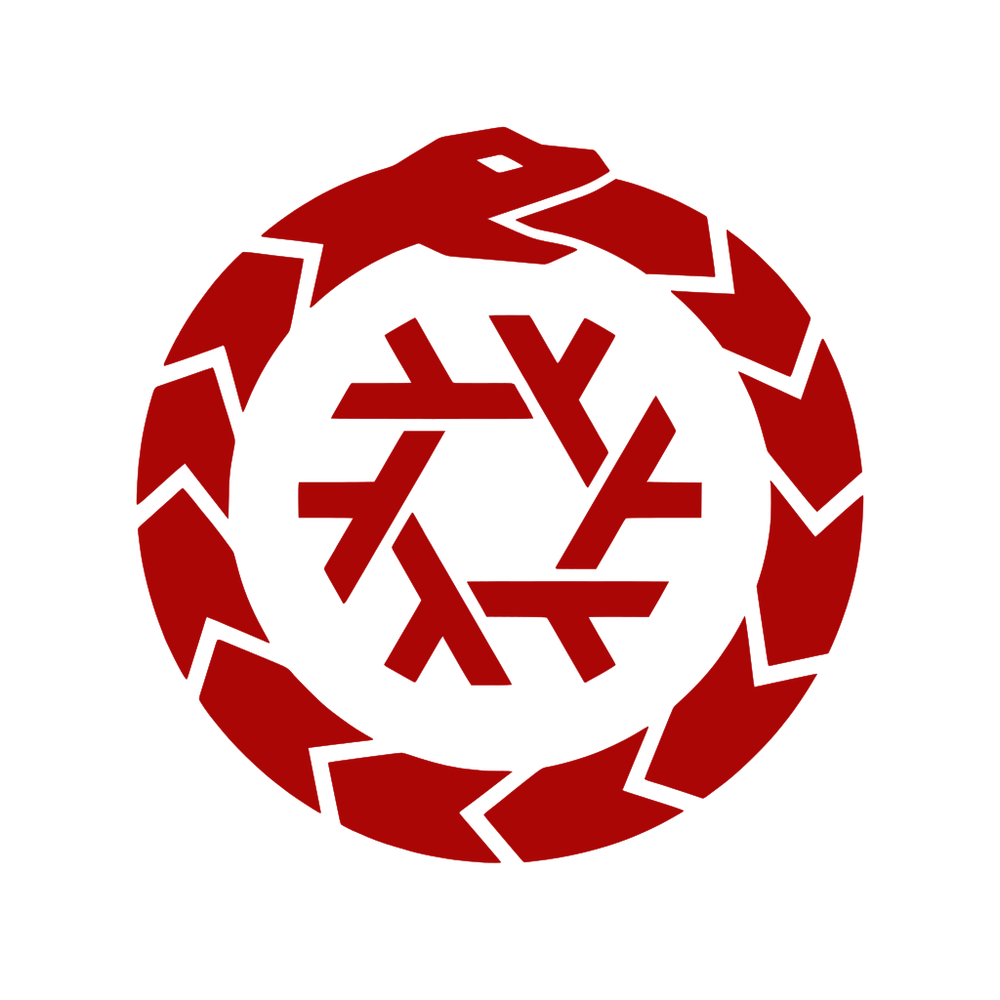

# OuroborOS

> **OUROBOROS**: **O**ne **U**nified **R**untime **O**rchestrating
> *a* **B**unch **O**f **R**andom **O**ld **S**ervers.
> *(The 'a' is silent.)* The machine that remakes itself. The tail
> feeds the head.

<p align="center">
  
</p>

A private, heterogeneous cluster of rejected hardware that presents
itself as **one honest computer**. Old PCs boot a stateless NixOS image,
measure themselves (never claim), announce themselves to the head over an
authenticated wire, and get work placed on them by a scheduler whose only
loyalties are capability and watts. The founding law is
[CONSTITUTION.md](CONSTITUTION.md): every design decision must cite an
article, and *"nobody does it that way"* is not a limitation.

**HISS** — the Hierarchical Interactive Shell System — is how you drive
it. The serpent is the joke stack: a machine that eats its own tail,
nine letters bullying ten words into a backronym, and a silent article
that carries no letter at all.

## Status — what is true today

- **Signed wire, both directions**: `seq <HMAC-SHA256 tag> body`, tags
  cover seq + payload, constant-time verify, opaque errors, no bypass
  flag. Agents refuse to start without the secret.
- **Push-based registry** (`ouro-registry`): tails register on boot and
  heartbeat telemetry every 5s; identity is the socket's peer IP, never
  self-reported. Re-registration is idempotent.
- **Scheduler with a spine**: workload-class filtering, capability
  ranking (VRAM > SIMD > watts), a hard energy-budget gate, and a real
  task queue (priority, retries, drain). Nothing places work around
  `Scheduler::schedule()`.
- **Error recovery**: failure counting with cooldown, stale sweeps,
  `recover.` drains displaced work to a new tail.
- **Node image** (NixOS, flake): stateless boot, measured identity
  (`sha256(SMBIOS | MAC)`), enrollment from an `OURO`-labeled partition
  with breadcrumbs, random boot motto, and a QEMU-proved signed serial
  join (`tools/wp7_prove.py`).

## Quickstart

```bash
# 1. Secret (once; same file on head and tails)
python3 -c "import secrets; print(secrets.token_hex(32))" > /etc/ouro/secret
chmod 600 /etc/ouro/secret
export OURO_SECRET_FILE=/etc/ouro/secret

# 2. Head: registry daemon
cargo run --release --bin ouro-registry -- --addr 0.0.0.0:9501 --state registry.json

# 3. Tail (or same box): agent, linked to the head
cargo run --release --bin ouro-agent -- --head 192.168.1.10:9501

# 4. Drive the machine
cargo run --release --bin ouro-hiss
```

```
hiss> ?
hiss> discover.
hiss> n2
hiss> power?
hiss> budget 120w.
hiss> recover.
```

## Terminology

The **head** is the machine you sit at (control plane). **Tails** are
the old boxes that booted the image (they run the agent). Telemetry
flows tail → head; tasks flow head → tail. Older documents said
master/slave; those words are retired.

## Documentation

| Doc | What it is |
|-----|------------|
| [docs/HANDBOOK.md](docs/HANDBOOK.md) | How to use it: binaries, verbs, enrollment, troubleshooting |
| [docs/ARCHITECTURE.md](docs/ARCHITECTURE.md) | How it works: wire spec, registry, scheduler math, boot sequence |
| [ARCHITECTURE.md](ARCHITECTURE.md) | The design blueprint (the settled shape) |
| [CONSTITUTION.md](CONSTITUTION.md) | The law. Articles, not suggestions. |
| [docs/R2_BRINGUP.md](docs/R2_BRINGUP.md) | Hardware-day runbook and execution journal |
| [docs/CONTRACTS.md](docs/CONTRACTS.md) | Parity ladders and acceptance contracts |

## License

Dual-licensed under [MIT](LICENSE-MIT) or [Apache-2.0](LICENSE-APACHE),
at your option. Copyright © 2026 Randy Smits-Schreuder Goedheijt.
